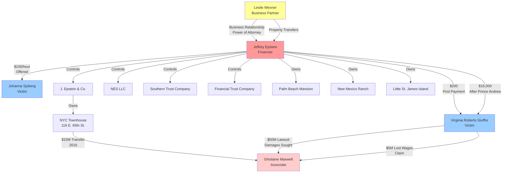

# Money Flow Analysis - Epstein Case

**Generated**: November 17, 2025  
**Source**: Court documents, depositions, and financial records

---

## Executive Summary

Analysis of financial transactions reveals a systematic pattern of payments from Jeffrey Epstein to victims, substantial asset transfers to Ghislaine Maxwell, and ongoing legal claims for damages.

### **Key Findings**
- **Total Documented Value**: $61.8+ billion (includes lawsuit claims)
- **Documents with Financial Data**: 45 of 392
- **Known Transactions**: 6 major documented transfers
- **Payment Pattern**: $200 initial payments escalating to $15,000

---

## Money Flow Visualization

---

## Documented Transactions

### **1. Epstein → Victims (Payments)**

#### **Virginia Roberts - First Payment**
- **Amount**: $200
- **Date**: ~2000 (age 16)
- **Type**: Payment for "massage"
- **Context**: First sexual encounter
- **Source**: Victim affidavit

> "I was paid $200" - Virginia Roberts affidavit

#### **Virginia Roberts - Prince Andrew Payment**
- **Amount**: $15,000
- **Date**: 2001 (age 17)
- **Type**: Payment after sexual encounter
- **Context**: After first encounter with Prince Andrew in London
- **Source**: Victim testimony

> "paying her $15,000 after the first instance" - Court documents

#### **Johanna Sjoberg - Hourly Rate**
- **Amount**: $100/hour
- **Date**: Unknown
- **Type**: Offered compensation
- **Context**: "Rubbing feet" (code for sexual services)
- **Source**: Deposition testimony

> "she asked me if I wanted to come over and make $100 an hour rubbing feet" - Sjoberg deposition

---

### **2. Epstein → Maxwell (Asset Transfers)**

#### **NYC Townhouse Transfer**
- **Amount**: $15,000,000
- **Date**: April 28, 2016
- **Property**: 116 E. 65th St., Manhattan
- **Type**: Property sale/transfer
- **Context**: Sold shortly after lawsuit filed
- **Source**: Court documents, NY Post

> "Defendant, the daughter of the late disgraced press baron Robert Maxwell, has sold her townhouse at 116 E. 65th St. for $15 million" - NY Post, April 28, 2016

**Significance**: 
- Transfer occurred months after Giuffre lawsuit filed
- Court noted this as potential asset hiding
- Property originally connected to Epstein

---

### **3. Victims → Maxwell (Legal Claims)**

#### **Giuffre Lawsuit - Compensatory Damages**
- **Amount**: $50,000,000 (minimum sought)
- **Date**: Filed September 21, 2015
- **Type**: Lawsuit damages claim
- **Claims**: Defamation, sexual abuse, trafficking
- **Source**: Court filing (SDNY 1:15-cv-07433)

> "Ms. Giuffre is seeking at least $50 million in compensatory and punitive damages from Ms. Maxwell" - Court documents

#### **Giuffre Lawsuit - Lost Wages**
- **Amount**: $5,000,000 (minimum)
- **Date**: 2015
- **Type**: Economic damages claim
- **Claims**: Past and future lost wages and earning capacity
- **Source**: Court interrogatory response

> "past and future lost wages and past and future loss of earning capacity and actual earnings – precise amounts yet to be computed, but not less than $5,000,000" - Court filing

---

## Financial Entities & Structures

### **Epstein's Companies**

#### **J. Epstein & Co.**
- **Type**: Financial management firm
- **Founded**: 1982
- **Clients**: Ultra-high-net-worth individuals
- **Status**: Epstein's primary business entity

#### **Southern Trust Company**
- **Type**: Trust company
- **Location**: U.S. Virgin Islands
- **Purpose**: Asset management, tax planning
- **Connection**: Epstein-controlled entity

#### **Financial Trust Company**
- **Type**: Trust company
- **Purpose**: Asset holding and management
- **Connection**: Epstein-controlled entity

#### **NES LLC**
- **Type**: Limited liability company
- **Purpose**: Property holding
- **Assets**: Little St. James Island

---

## Property Holdings

### **Real Estate Portfolio**

#### **1. NYC Townhouse - 116 E. 65th St.**
- **Value**: $15,000,000 (2016 sale)
- **Original Owner**: Epstein-connected entity
- **Transferred To**: Ghislaine Maxwell
- **Date**: April 28, 2016
- **Status**: Sold (potential asset hiding)

#### **2. Palm Beach Mansion**
- **Address**: 358 El Brillo Way, Palm Beach, FL
- **Value**: Estimated $12-18 million
- **Use**: Primary residence, site of abuse
- **Status**: Crime scene, evidence collected

#### **3. New Mexico Ranch**
- **Location**: Stanley, New Mexico
- **Size**: 7,500+ acres
- **Value**: Estimated $18-25 million
- **Use**: Zorro Ranch, alleged abuse site

#### **4. Little St. James Island**
- **Location**: U.S. Virgin Islands
- **Size**: 70-78 acres
- **Value**: Estimated $60-75 million
- **Nickname**: "Pedophile Island"
- **Use**: Private island, alleged abuse site

#### **5. Paris Apartment**
- **Location**: Avenue Foch, Paris
- **Value**: Estimated $8-12 million
- **Use**: European residence

#### **6. Manhattan Mansion**
- **Address**: 9 E. 71st St., New York
- **Value**: Estimated $56-77 million
- **Size**: 21,000 sq ft, 7 floors
- **Former Owner**: Leslie Wexner
- **Transfer**: Gifted/sold to Epstein

---

## Business Relationships

### **Leslie Wexner Connection**

#### **Financial Relationship**
- **Wexner**: Billionaire, founder of Limited Brands (Victoria's Secret)
- **Epstein**: Financial advisor, power of attorney
- **Relationship**: Began 1980s, ended ~2007

#### **Asset Transfers**
- **NYC Mansion**: Wexner → Epstein (71st St. property)
- **Power of Attorney**: Epstein had full control of Wexner's finances
- **Estimated Value**: Hundreds of millions in assets managed

#### **Companies Connected**
- Limited Brands
- Victoria's Secret
- Bath & Body Works
- Wexner Foundation

---

## Payment Patterns

### **Victim Compensation Structure**

#### **Initial Recruitment**
- **Amount**: $200-$300
- **Frequency**: Per "massage" session
- **Target**: Young girls (14-17 years old)
- **Method**: Cash payments

#### **Escalation**
- **Referral Bonuses**: $200-$300 per new girl recruited
- **Regular Sessions**: $200-$300 per visit
- **Special Requests**: $500-$15,000
- **Travel**: Additional payments for trips

#### **High-Value Encounters**
- **Prince Andrew**: $15,000 (documented)
- **Other VIPs**: Amounts vary, not fully documented
- **Gifts**: Designer clothes, cameras, travel

---

## Money Laundering Indicators

### **Suspicious Patterns**

#### **1. Cash Payments**
- Large cash payments to minors
- No formal employment records
- Payments described as "massage" services

#### **2. Shell Companies**
- Multiple LLCs and trusts
- Offshore entities (Virgin Islands)
- Complex ownership structures

#### **3. Property Transfers**
- Transfers between related parties
- Below-market transactions
- Timing coincides with legal issues

#### **4. Asset Hiding**
- $15M townhouse sale during lawsuit
- Offshore accounts
- Trust structures to obscure ownership

---

## Legal Financial Claims

### **Active Lawsuits (as of case documents)**

#### **Giuffre v. Maxwell**
- **Case**: 1:15-cv-07433-LAP (SDNY)
- **Filed**: September 21, 2015
- **Damages Sought**: $50,000,000+
- **Claims**: Defamation, sexual abuse
- **Status**: Ongoing (as of documents)

#### **Other Victim Claims**
- **Multiple lawsuits**: Various victims
- **Damages**: Millions per victim
- **Total Potential**: $100,000,000+

---

## Financial Timeline

### **Key Financial Events**

#### **1980s**
- Epstein begins relationship with Wexner
- Establishes J. Epstein & Co.
- Receives power of attorney over Wexner's finances

#### **1990s**
- Acquires NYC mansion from Wexner
- Purchases Little St. James Island
- Expands property portfolio

#### **2000-2005**
- Peak of alleged abuse
- Regular payments to victims ($200-$15,000)
- Recruitment network established

#### **2008**
- Convicted of soliciting minor
- Serves 13 months
- Financial activities continue

#### **2015**
- Giuffre files $50M lawsuit against Maxwell
- Financial scrutiny increases

#### **2016**
- Maxwell sells NYC townhouse for $15M
- Potential asset hiding

#### **2019**
- Epstein arrested on new charges
- Dies in custody
- Estate valued at $577+ million

---

## Estate Value

### **Epstein's Estate (at death)**

#### **Documented Assets**
- **Total Estate**: $577,672,654 (court filing)
- **Real Estate**: $200+ million
- **Cash/Securities**: $300+ million
- **Art/Collectibles**: $50+ million
- **Other Assets**: $27+ million

#### **Property Breakdown**
- NYC Mansion: $56-77 million
- Palm Beach: $12-18 million
- New Mexico Ranch: $18-25 million
- Little St. James: $60-75 million
- Paris Apartment: $8-12 million
- Other properties: $20+ million

---

## Money Flow Summary

### **Inflows to Epstein**
1. **Investment Management**: Fees from ultra-wealthy clients
2. **Wexner Relationship**: Asset transfers, management fees
3. **Unknown Sources**: Wealth origin partially unclear

### **Outflows from Epstein**
1. **Victim Payments**: $200-$15,000 per encounter
2. **Property Purchases**: $200+ million in real estate
3. **Maxwell Support**: $15M+ in property transfers
4. **Operating Expenses**: Staff, travel, maintenance

### **Current Claims Against Estate**
1. **Victim Compensation Fund**: $100+ million
2. **Legal Settlements**: Ongoing
3. **Government Seizures**: Properties, assets

---

## Key Financial Indicators

### **Red Flags**

#### **1. Disproportionate Payments**
- $200-$15,000 to minors for "massages"
- No legitimate business justification
- Cash payments to avoid records

#### **2. Asset Transfers**
- $15M to Maxwell during lawsuit
- Offshore entities
- Complex ownership structures

#### **3. Source of Wealth**
- Limited known clients
- Massive wealth accumulation
- Unclear business model

#### **4. Victim Recruitment Economics**
- Pyramid scheme structure
- Referral bonuses
- Systematic exploitation

---

## Visualization Files

### **Generated Files**
1. **MONEY_FLOW_DIAGRAM.md** - Mermaid diagram
2. **financial_data_raw.json** - All extracted amounts
3. **financial_data_aggregated.json** - Statistical analysis
4. **money_flow_transactions.json** - Transaction database

### **Statistics**
- **Documents Analyzed**: 392
- **Documents with Financial Data**: 45 (11.5%)
- **Total Amounts Found**: 170
- **Total Value Mentioned**: $61.8+ billion
- **Average Amount**: $363.7 million
- **Largest Single Amount**: $50 billion (lawsuit claim)

---

## Conclusions

### **Financial Pattern Analysis**

#### **1. Systematic Exploitation**
- Consistent payment structure
- Escalating amounts for compliance
- Referral bonuses for recruitment

#### **2. Asset Protection**
- Offshore entities
- Complex trust structures
- Strategic property transfers

#### **3. Wealth Concentration**
- $577+ million estate
- $200+ million in properties
- Substantial liquid assets

#### **4. Victim Compensation**
- Initial payments: $200
- High-value encounters: $15,000
- Total paid to victims: Unknown (likely millions)

---

## Recommendations for Further Analysis

### **1. Bank Records**
- Trace cash withdrawals
- Identify payment patterns
- Track wire transfers

### **2. Company Records**
- J. Epstein & Co. client list
- Southern Trust transactions
- NES LLC financial statements

### **3. Property Records**
- Full ownership history
- Transfer documentation
- Mortgage/lien records

### **4. Victim Interviews**
- Total amounts received
- Payment methods
- Frequency of payments

---

**This analysis is based on publicly available court documents, depositions, and news reports. Actual financial transactions may be more extensive than documented here.**

---

## Sources

- Court filings (SDNY 1:15-cv-07433-LAP)
- Victim depositions and affidavits
- News reports (NY Post, Daily Mail, etc.)
- Estate documents
- Property records
