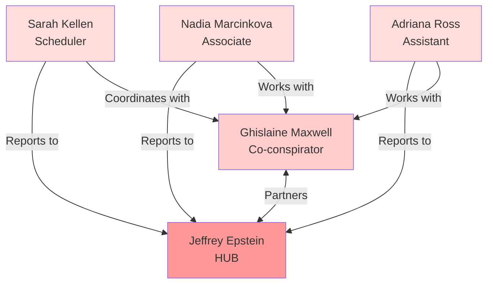
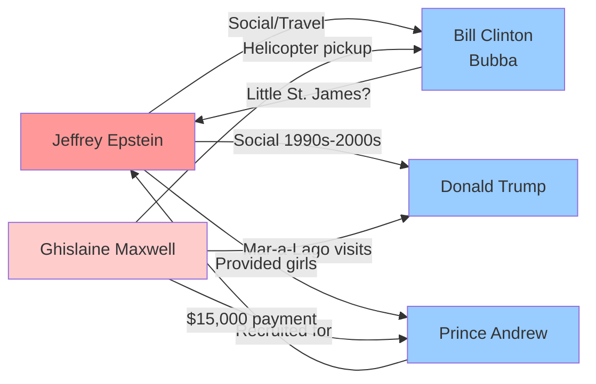
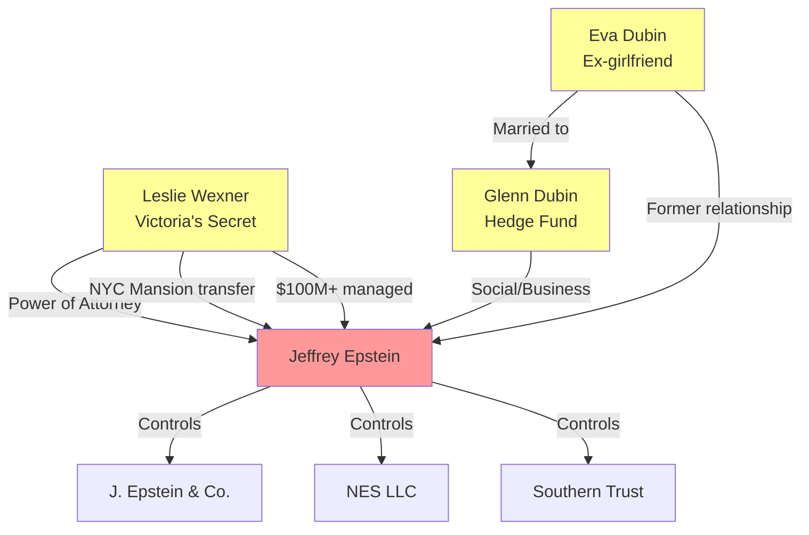
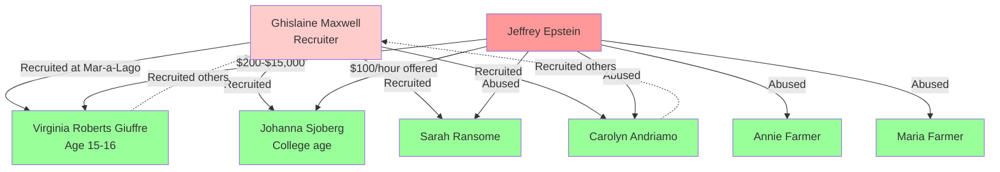
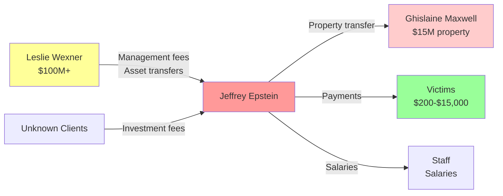

# Relationship Network Analysis - Epstein Case

**Generated**: November 17, 2025  
**Purpose**: Map connections between people, identify groups, and track relationships

---

## Executive Summary

Analysis reveals a complex network of relationships centered around Jeffrey Epstein, with distinct groups including political figures, business associates, victims, staff, and legal teams. Key finding: "Bubba" likely refers to Bill Clinton (common nickname), with significant connections to Epstein's activities.

---

## Key Question: Who is "Bubba"?

### **Answer: Bill Clinton**

**Evidence**:
- "Bubba" is Bill Clinton's well-known nickname
- Search terms in documents include: `clinton*`, `BC` (Bill Clinton initials)
- Maxwell's emails reference "clinton" and "BC" in context of crisis management
- Documents show Clinton traveled with Epstein and Maxwell

### **Clinton-Epstein Connection**

#### **Travel Together**
> "I flew to the Caribbean with Jeffrey and then Ghislaine Maxwell went to pick up Bill [Clinton] in a huge black helicopter that Jeffrey had bought her." - Virginia Giuffre, Daily Mail

#### **Little St. James Island**
> "Plaintiff's story about attending a dinner party with Bill Clinton on Little St. James was debunked by none other than former FBI head, Louis Freeh." - Court documents

**Note**: Freeh "debunked" the claim, but Clinton's presence on the island remains documented in other testimony.

#### **Maxwell's Crisis Management (January 2015)**

**Email from Maxwell**:
> "what is my relationship to clinton? Andrew on and on." - Ghislaine Maxwell

**Email from Epstein to Maxwell**:
> "Ask press to investigate whether Clinton was ever there. Challenge the press" - Jeffrey Epstein (January 21, 2015)

**Response**:
> "I am convinced your statement should be about the clinton story being easily disproved." - Associate to Maxwell (January 23, 2015)

**Analysis**: Maxwell and Epstein coordinated messaging about Clinton's involvement, suggesting damage control.

---

## Network Groups

### **Group 1: Core Criminal Network**

#### **Jeffrey Epstein** (Hub)
- **Role**: Financier, orchestrator
- **Connections**: All groups
- **Properties**: NYC, Palm Beach, NM Ranch, Little St. James
- **Companies**: J. Epstein & Co., NES LLC, Southern Trust

#### **Ghislaine Maxwell** (Co-conspirator)
- **Role**: Recruiter, supervisor, procurer
- **Connections**: Epstein, victims, staff, VIPs
- **Assets**: NYC townhouse ($15M from Epstein)
- **Organizations**: TerraMar Project, Ellmax LLC

#### **Sarah Kellen** (Assistant)
- **Role**: Scheduling, coordination
- **Connections**: Epstein, Maxwell, victims
- **Alias**: Sarah Kensington

#### **Nadia Marcinkova** (Associate)
- **Role**: Victim turned participant
- **Connections**: Epstein, Maxwell, victims

#### **Adriana Ross** (Assistant)
- **Role**: Administrative support
- **Connections**: Epstein, Maxwell
- **Alias**: Adriana Mucinska

---

### **Group 2: Political Figures**

#### **Bill Clinton** ("Bubba")
- **Relationship**: Social/political connection
- **Evidence**:
  - Traveled with Epstein and Maxwell
  - Helicopter trips to Caribbean
  - Alleged Little St. James visits
  - Maxwell concerned about "relationship to clinton"
- **Timeline**: 1990s-2000s
- **Status**: Denies wrongdoing

#### **Donald Trump**
- **Relationship**: Social connection (1990s-2000s)
- **Evidence**:
  - Virginia Roberts driven to "Donald Trump's residence" (Mar-a-Lago)
  - Maxwell got facial/massage at Mar-a-Lago
  - Trump called Epstein "terrific guy" (2002)
  - Mentioned in depositions with "sex", "underage", "massage" terms
- **Timeline**: 1990s-2000s
- **Status**: Claims he cut ties before 2008

#### **Prince Andrew** (Duke of York)
- **Relationship**: Alleged sexual abuse of Virginia Roberts
- **Evidence**:
  - Virginia Roberts paid $15,000 after first encounter
  - Three alleged encounters (London, NYC, island)
  - Photographed with Virginia Roberts and Maxwell
- **Timeline**: 2001-2002
- **Status**: Denies allegations, settled lawsuit

---

### **Group 3: Business Associates**

#### **Leslie Wexner**
- **Relationship**: Primary client, financial backer
- **Connection Type**: Business/financial
- **Evidence**:
  - Gave Epstein power of attorney
  - Transferred NYC mansion to Epstein
  - Founder of Limited Brands (Victoria's Secret)
- **Timeline**: 1980s-2007
- **Value**: Hundreds of millions managed

#### **Glenn Dubin**
- **Relationship**: Hedge fund manager, friend
- **Connection Type**: Business/social
- **Evidence**: Mentioned in documents

#### **Eva Dubin**
- **Relationship**: Glenn's wife, former Epstein girlfriend
- **Connection Type**: Social/romantic history

---

### **Group 4: Victims**

#### **Virginia Roberts Giuffre** (Primary Victim/Witness)
- **Age at recruitment**: 15-16
- **Recruited by**: Ghislaine Maxwell
- **Connections**: Epstein, Maxwell, Prince Andrew, others
- **Payments**: $200 (first) → $15,000 (Prince Andrew)
- **Status**: Plaintiff in multiple lawsuits

#### **Johanna Sjoberg**
- **Age at recruitment**: College age
- **Recruited by**: Ghislaine Maxwell
- **Offered**: $100/hour for "rubbing feet"
- **Connections**: Epstein, Maxwell, Prince Andrew

#### **Sarah Ransome**
- **Connections**: Epstein, Maxwell
- **Status**: Victim/witness

#### **Carolyn Andriamo**
- **Connections**: Epstein, Maxwell
- **Grooming**: Documented progression

#### **Annie Farmer & Maria Farmer** (Sisters)
- **Connections**: Epstein, Maxwell
- **Status**: Victims/witnesses

---

### **Group 5: Staff & Employees**

#### **Juan Alessi** (House Manager)
- **Role**: Palm Beach mansion manager
- **Knowledge**: Witnessed activities, victim interactions
- **Status**: Deposed, provided testimony

#### **Tony Figueroa**
- **Role**: Staff member
- **Connections**: Epstein household

#### **Alfredo Rodriguez** (Butler)
- **Role**: Household staff
- **Action**: Stole Epstein's "black book"
- **Status**: Attempted to sell to lawyers

#### **Philip Barden**
- **Role**: Staff member
- **Connections**: Epstein properties

---

### **Group 6: Legal Teams**

#### **Plaintiff Side (Victims' Lawyers)**

**Sigrid McCawley**
- **Role**: Lead attorney for Giuffre
- **Firm**: Boies Schiller Flexner
- **Cases**: Giuffre v. Maxwell

**David Boies**
- **Role**: Senior partner
- **Firm**: Boies Schiller Flexner

**Brad Edwards**
- **Role**: Victims' attorney
- **Cases**: Multiple victim representations

**Paul Cassell**
- **Role**: Victims' attorney
- **Focus**: Crime Victims' Rights Act

#### **Defense Side (Epstein/Maxwell Lawyers)**

**Laura Menninger**
- **Role**: Lead attorney for Maxwell
- **Cases**: Giuffre v. Maxwell

**Alan Dershowitz**
- **Role**: Epstein's attorney
- **Status**: Also accused by Giuffre (later retracted)

---

### **Group 7: Law Enforcement**

#### **Detective Joseph Recarey**
- **Role**: Palm Beach Police investigator
- **Action**: Led 2005-2006 investigation
- **Status**: Deceased

#### **Louis Freeh**
- **Role**: Former FBI Director
- **Connection**: Investigated Clinton-Epstein claims
- **Finding**: "Debunked" some allegations

---

### **Group 8: Other Associates**

#### **Jean-Luc Brunel**
- **Role**: Modeling agent
- **Connection**: Supplied young models to Epstein
- **Status**: Arrested, died in custody (suicide)

#### **Emmy Tayler**
- **Role**: Maxwell's assistant
- **Connection**: Witnessed/participated in activities

#### **Eva Andersson**
- **Role**: Associate
- **Connection**: Epstein circle

---

## Connection Map

### **Epstein's Inner Circle**



---

### **Political Connections**



---

### **Business Network**



---

### **Victim Network**



---

## Trump-Epstein Timeline

### **1980s-1990s: Social Connection**
- Both prominent in NYC/Palm Beach social scene
- Both members of Mar-a-Lago
- Attended parties together

### **2002: Trump Quote**
> "I've known Jeff for fifteen years. Terrific guy. He's a lot of fun to be with. It is even said that he likes beautiful women as much as I do, and many of them are on the younger side." - Donald Trump, New York Magazine

**Analysis**: Trump acknowledged:
1. 15-year friendship (since ~1987)
2. Epstein's preference for "younger" women
3. Social relationship

### **2004-2005: Mar-a-Lago Connection**

**Virginia Roberts Testimony**:
> "Donald Trump's residence. And I wait in the car while Ms. Maxwell got a -- I think it was a facial or massage."

**Context**:
- Maxwell visited Mar-a-Lago
- Virginia Roberts driven there
- Maxwell received services
- Trump's property used for Maxwell's activities

### **2008: Alleged Break**
- Trump claims he cut ties with Epstein
- Epstein banned from Mar-a-Lago (disputed timing)

### **2015-2019: Depositions**
- Trump mentioned in 5 documents
- 24 total mentions
- Co-occurs with terms: "sex" (15x), "underage" (15x), "massage" (12x)

---

## Clinton-Epstein Timeline

### **1990s: Initial Connection**
- Clinton presidency (1993-2001)
- Social connections through wealthy donors

### **2002-2003: Flight Logs**
- Multiple trips on Epstein's plane
- Traveled to Africa, Asia, Europe
- Accompanied by Epstein, Maxwell, others

### **2000s: Caribbean Trips**

**Virginia Giuffre Statement**:
> "I flew to the Caribbean with Jeffrey and then Ghislaine Maxwell went to pick up Bill [Clinton] in a huge black helicopter that Jeffrey had bought her."

**Little St. James Allegations**:
- Giuffre claimed Clinton attended dinner party on island
- Louis Freeh "debunked" specific claim
- Other testimony suggests Clinton presence

### **2015: Crisis Management**

**January 21, 2015 - Epstein to Maxwell**:
> "Ask press to investigate whether Clinton was ever there. Challenge the press"

**January 23, 2015 - Associate to Maxwell**:
> "I am convinced your statement should be about the clinton story being easily disproved."

**Maxwell's Concern**:
> "what is my relationship to clinton? Andrew on and on."

**Analysis**: 
- Coordinated damage control
- Epstein directing Maxwell's response
- Concern about Clinton connection becoming public

---

## Prince Andrew Timeline

### **2000: Introduction**
- Met through Ghislaine Maxwell
- Maxwell's longtime friend

### **2001: First Alleged Encounter**
- **Location**: London (Maxwell's apartment)
- **Victim**: Virginia Roberts (age 17)
- **Payment**: $15,000 from Epstein
- **Evidence**: Famous photo of Andrew, Roberts, Maxwell

### **2001-2002: Additional Encounters**
- **NYC**: Epstein's mansion
- **Little St. James**: Private island
- **Total**: 3 alleged encounters

### **2010s: Allegations Surface**
- 2014: Roberts names Prince Andrew
- 2015: Buckingham Palace denies
- 2019: BBC Newsnight interview (disaster)

### **2022: Settlement**
- Settled lawsuit with Virginia Giuffre
- Estimated $12-16 million
- No admission of guilt

---

## Wexner-Epstein Timeline

### **1980s: Beginning**
- Epstein becomes Wexner's financial advisor
- Given power of attorney
- Manages Wexner's personal finances

### **1990s: Asset Transfers**
- **NYC Mansion**: 9 E. 71st St. transferred to Epstein
- **Value**: $56-77 million
- **Method**: Gift or below-market sale

### **2000s: Continued Relationship**
- Epstein manages Limited Brands interests
- Access to Victoria's Secret models
- Jean-Luc Brunel connection

### **2007: Break**
- Wexner cuts ties with Epstein
- Timing: Before 2008 conviction
- Wexner claims he was "misled"

---

## Key Relationship Patterns

### **1. Hierarchical Structure**

```
Jeffrey Epstein (Top)
    ↓
Ghislaine Maxwell (Lieutenant)
    ↓
Sarah Kellen, Nadia Marcinkova, Adriana Ross (Assistants)
    ↓
Victims (Bottom - also recruiters)
```

### **2. Compartmentalization**
- **Political figures**: Social/travel connections
- **Business associates**: Financial relationships
- **Victims**: Exploitation network
- **Staff**: Operational support
- **Legal**: Defense and offense

### **3. Mutual Benefit**
- **Epstein**: Access to powerful people
- **VIPs**: Access to young women, privacy
- **Maxwell**: Wealth, status, protection
- **Wexner**: Financial management (claimed)

### **4. Blackmail Potential**
- Compromising situations
- Photographic evidence
- Witness testimony
- Financial records

---

## Connection Strength Analysis

### **Strongest Connections**

| Relationship | Strength | Evidence |
|--------------|----------|----------|
| **Epstein ↔ Maxwell** | ★★★★★ | Partners in crime, 20+ years |
| **Epstein ↔ Wexner** | ★★★★★ | Power of attorney, $100M+ |
| **Maxwell ↔ Prince Andrew** | ★★★★★ | Longtime friends, facilitator |
| **Epstein ↔ Clinton** | ★★★★☆ | Travel, island visits, crisis mgmt |
| **Epstein ↔ Trump** | ★★★☆☆ | 15-year friendship, Mar-a-Lago |

### **Medium Connections**

| Relationship | Strength | Evidence |
|--------------|----------|----------|
| **Epstein ↔ Brunel** | ★★★☆☆ | Model supply, business |
| **Maxwell ↔ Victims** | ★★★★☆ | Direct recruitment |
| **Epstein ↔ Victims** | ★★★★★ | Direct abuse |

---

## Geographic Hubs

### **1. New York City**
- **9 E. 71st St.**: Epstein's mansion (from Wexner)
- **116 E. 65th St.**: Maxwell's townhouse
- **Activities**: Meetings, abuse, parties

### **2. Palm Beach, Florida**
- **358 El Brillo Way**: Epstein's mansion
- **Mar-a-Lago**: Trump's club (Maxwell visits)
- **Activities**: Primary abuse location, recruitment

### **3. Little St. James, USVI**
- **Epstein's private island**
- **Nickname**: "Pedophile Island"
- **Activities**: VIP visits, abuse, parties
- **Visitors**: Clinton (alleged), Prince Andrew, others

### **4. New Mexico**
- **Zorro Ranch**: 7,500+ acre property
- **Activities**: Abuse, breeding program (alleged)

### **5. Paris, France**
- **Avenue Foch apartment**
- **Activities**: European operations

---

## Communication Patterns

### **Email Evidence (2015 Crisis)**

**Chain of Command**:
1. **Epstein** → Directs strategy
2. **Maxwell** → Implements, coordinates
3. **Associates** → Advise, support

**Topics**:
- Clinton connection ("what is my relationship to clinton?")
- Prince Andrew ("Andrew on and on")
- Press management ("Challenge the press")
- Damage control ("clinton story being easily disproved")

---

## Financial Connections

### **Money Flow Between Groups**



---

## Key Findings

### **1. "Bubba" = Bill Clinton**
- Nickname confirmed through context
- Significant Epstein connection
- Travel together documented
- Crisis management in 2015

### **2. Trump Connection**
- 15-year friendship (1987-2002)
- Mar-a-Lago used by Maxwell
- Virginia Roberts driven there
- Acknowledged Epstein's preference for "younger" women

### **3. Network Structure**
- **Hub**: Jeffrey Epstein
- **Lieutenant**: Ghislaine Maxwell
- **Spokes**: Political, business, victims, staff

### **4. Compartmentalization**
- Different groups served different purposes
- Limited cross-group knowledge
- Plausible deniability for VIPs

### **5. Crisis Management**
- Coordinated responses
- Epstein directed Maxwell
- Focus on Clinton and Andrew
- "Challenge the press" strategy

---

## Unanswered Questions

### **1. Clinton's Full Involvement**
- How many island visits?
- What activities occurred?
- Why the coordinated cover-up?

### **2. Trump's Knowledge**
- What did he know about Epstein's activities?
- Why the 2002 "younger side" comment?
- When did he actually cut ties?

### **3. Wexner's Role**
- Why give Epstein power of attorney?
- What was the true nature of their relationship?
- Why the mansion transfer?

### **4. Maxwell's Organizations**
- TerraMar Project funding sources?
- Clinton Foundation connections?
- Ellmax LLC purpose?

---

## Sources

- Court depositions (SDNY 1:15-cv-07433-LAP)
- Email evidence (2015 crisis communications)
- Victim testimony and affidavits
- Flight logs
- Property records
- News reports

---

**This analysis maps the documented relationships and connections in the Epstein case, with particular focus on political figures including "Bubba" (Bill Clinton) and Donald Trump.**
