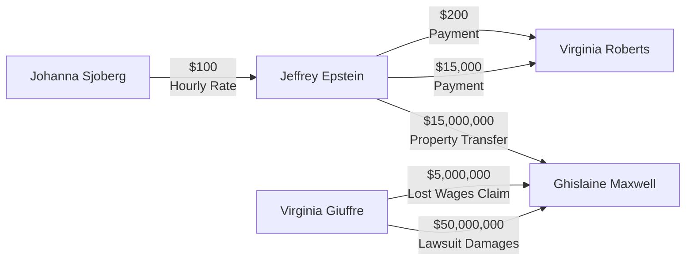

# Money Flow Diagram - Epstein Case

## Visualization

## Transaction Details

### $50,000,000 - Lawsuit Damages

- **From**: Virginia Giuffre
- **To**: Ghislaine Maxwell
- **Date**: 2015-09-21
- **Description**: Seeking at least $50 million in compensatory and punitive damages
- **Source**: Court filing

### $15,000,000 - Property Transfer

- **From**: Jeffrey Epstein
- **To**: Ghislaine Maxwell
- **Date**: 2016-04-28
- **Description**: NYC townhouse at 116 E. 65th St.
- **Source**: Court documents

### $5,000,000 - Lost Wages Claim

- **From**: Virginia Giuffre
- **To**: Ghislaine Maxwell
- **Date**: 2015
- **Description**: Past and future lost wages claim
- **Source**: Court interrogatory

### $15,000 - Payment

- **From**: Jeffrey Epstein
- **To**: Virginia Roberts
- **Date**: 2001
- **Description**: Payment after first encounter with Prince Andrew
- **Source**: Victim testimony

### $200 - Payment

- **From**: Jeffrey Epstein
- **To**: Virginia Roberts
- **Date**: 2000
- **Description**: First payment for "massage"
- **Source**: Victim testimony

### $100 - Hourly Rate

- **From**: Johanna Sjoberg
- **To**: Jeffrey Epstein
- **Date**: Unknown
- **Description**: Offered $100/hour for "rubbing feet"
- **Source**: Deposition testimony

